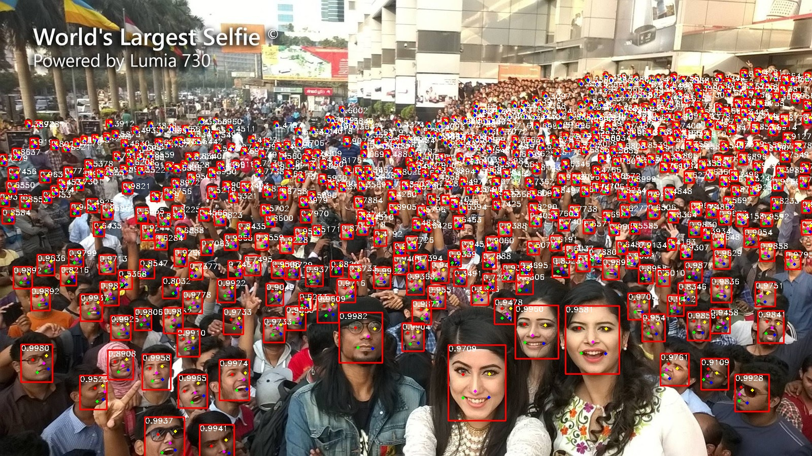

# Blazeface
## 实现功能
 - Blazeface的训练/测试/评估/ncnn C++推理
 - Face-Detector-1MB slim和RFB版本的训练/测试/评估/ncnn C++推理
 - 人脸5个关键点检测
 - 支持onnx导出
 - 网络parameter和flop计算

# 网页版demo
*  run in web browser! 👉 https://github.com/zineos/ncnn-webassembly-blazeface
# 带有关键点检测的超轻量级人脸检测器（小于1MB）

提供了一系列适合移动端部署包含关键的人脸检测器: 在[Face-Detector-1MB](https://github.com/biubug6/Face-Detector-1MB-with-landmark)基础上实现了Blazeface 并添加了关键点检测和ncnn C++部署功能.

<p align="center"></p>

## 测试的运行环境
- Ubuntu20.04
- Python3.8.5
- Pytorch1.7
- CUDA11.2 + CUDNN8

## 精度
### Widerface测试

 - 在wider face val精度（单尺度输入分辨率：**320*240**）
 
 方法|Easy|Medium|Hard
------|--------|----------|--------
libfacedetection v1（caffe）|0.65 |0.5       |0.233
libfacedetection v2（caffe）|0.714 |0.585       |0.306
version-slim(原版)|0.765     |0.662       |0.385
version-RFB(原版)|0.784     |0.688       |0.418
version-slim(our)|0.795     |0.683       |0.34.5
version-RFB(our)|**0.814**     |0.710       |0.363
Retinaface-Mobilenet-0.25(our)  |0.811|0.697|0.376
Blazeface  |0.782  |**0.715**  |**0.394**

- 在wider face val精度（单尺度输入分辨率：**640*480**） 

方法|Easy|Medium|Hard 
------|--------|----------|--------
libfacedetection v1（caffe）|0.741 |0.683       |0.421
libfacedetection v2（caffe）|0.773 |0.718       |0.485
version-slim(原版)|0.757     |0.721       |0.511
version-RFB(原版)|0.851     |0.81       |0.541
version-slim(our)|0.850     |0.808       |0.595
version-RFB(our)|0.865    |0.828       |0.622
Retinaface-Mobilenet-0.25(our)  |0.873|**0.836**|0.638
Blazeface |**0.877**|0.816 |**0.639**

ps: 测试的时候,长边为320 或者 640 ,图像等比例缩放.

## Parameter and flop

方法|parameter(M)|flop(M) 
------|--------|----------
version-slim(our)|0.343     |98.793
version-RFB(our)|0.359    |118.435
Retinaface-Mobilenet-0.25(our)  |0.426|193.921
Blazeface |**0.175**| 228.134

ps: 320*240作为输入

## inference speed benmark

方法|inference(ms)|nms(ms) 
------|--------|----------
version-slim(our)|3.3    |20
version-RFB(our)|4.3    |21
Retinaface-Mobilenet-0.25(our)  |4.6|20
Blazeface |4.3|22

ps: 长边为 640 作为输入, 图像等比例缩放, 使用gpu为3090, 使用test.py测试

### Model size comparison
- Comparison of several open source lightweight face detection models:

Model|model file size（MB）
------|--------
libfacedetection v1（caffe）| 2.58
libfacedetection v2（caffe）| 3.34
Official Retinaface-Mobilenet-0.25 (Mxnet) | 1.68
version-slim| 1.04
version-RFB| 1.11
Blazeface | **0.78**


### Contents
- [Installation](#installation)
- [Training](#training)
- [Evaluation](#evaluation)
- [C++_inference _ncnn](#c++_inference_ncnn)
- [References](#references)

## Installation
##### Clone and install
1. git clone https://github.com/zineos/Blazeface.git

2. Pytorch version 1.7.0+ and torchvision 0.6.0+ are needed.

3. Codes are based on Python 3

##### Data
1. The dataset directory as follows:

```Shell
  ./data/widerface/
    train/
      images/
      label.txt
    val/
      images/
      wider_val.txt
```
ps: wider_val.txt only include val file names but not label information.

2. We provide the organized dataset we used as in the above directory structure.

Link: from [google cloud](https://drive.google.com/open?id=11UGV3nbVv1x9IC--_tK3Uxf7hA6rlbsS) or [baidu cloud](https://pan.baidu.com/s/1jIp9t30oYivrAvrgUgIoLQ) Password: ruck

## Training

1. Before training, you can check network configuration (e.g. batch_size, min_sizes and steps etc..) in ``config/config.py and tool/train.py``.

2. Train the model using WIDER FACE:
  ```Shell
  CUDA_VISIBLE_DEVICES=0 python train.py --network Blaze
  ```

If you don't want to train, we also provide a trained model on ./weights
  ```Shell
  Blaze_Final_640.pth
  ```
## Evaluation
### Evaluation widerface val
1. Generate txt file
```Shell
cd blazeface/evaluator
python test_widerface.py --trained_model weight_file --network Blaze
```
2. Evaluate txt results. Demo come from [Here](https://github.com/wondervictor/WiderFace-Evaluation)
```Shell
cd ./widerface_evaluate
python setup.py build_ext --inplace
python evaluation.py
```
3. You can also use widerface official Matlab evaluate demo in [Here](http://mmlab.ie.cuhk.edu.hk/projects/WIDERFace/WiderFace_Results.html)

## C++_inference _ncnn
1. Generate onnx file
```Shell
cd tools
python export.py --trained_model weight_file --network Blaze
```
2. Onnx file change to ncnn(*.param and *.param)
```Shell
cd ./demo_ncnn/model
python3 -m onnxsim blazeface.onnx blazeface_sim.onnx
./demo_ncnn/tools/onnx2ncnn blazeface_sim.onn blazeface.param blazeface.bin
```
3. Build Project(set opencv path in CmakeList.txt)
```Shell
mkdir build
cd build
cmake ..
make -j4
```
5. run
```Shell
./FaceDetector *.jpg
```

We also provide the converted file in ".demo_ncnn/model".
```Shell
blazeface.param
blazeface.bin
```


## References
- [FaceBoxes](https://github.com/zisianw/FaceBoxes.PyTorch)
- [Retinaface (mxnet)](https://github.com/deepinsight/insightface/tree/master/RetinaFace)
- [Retinaface (pytorch)](https://github.com/biubug6/Pytorch_Retinaface)
- [Ultra-Light-Fast-Generic-Face-Detector-1MB](https://github.com/Linzaer/Ultra-Light-Fast-Generic-Face-Detector-1MB)
- [Face-Detector-1MB](https://github.com/biubug6/Face-Detector-1MB-with-landmark)
```
@article{bazarevsky2019blazeface,
  title={Blazeface: Sub-millisecond neural face detection on mobile gpus},
  author={Bazarevsky, Valentin and Kartynnik, Yury and Vakunov, Andrey and Raveendran, Karthik and Grundmann, Matthias},
  journal={arXiv preprint arXiv:1907.05047},
  year={2019}
}
```
